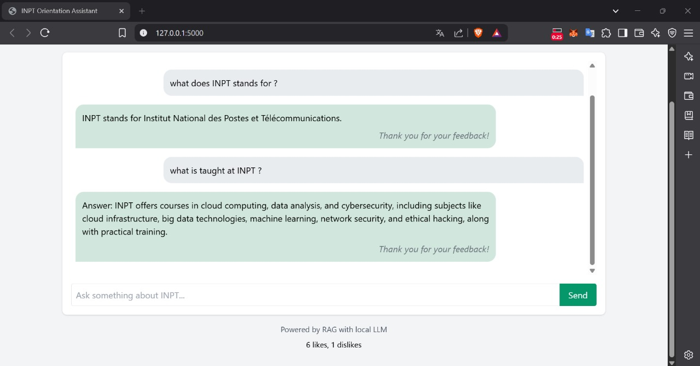

# 🧠 INPT Orientation Assistant (RAG + RLHF)

Welcome to the **INPT Orientation Assistant**, an AI-powered assistant using **RAG (Retrieval-Augmented Generation)** and **RLHF (Reinforcement Learning from Human Feedback)**. This chatbot is designed to guide students in exploring orientation options at INPT such as:

- 🌐 Cloud / IoT
- 🛡 Cybersecurity
- 🏫 General INPT Data

---

## 📸 Interface Preview

Here is a preview of the assistant running on localhost:

<p align="center">
  
</p>

---


## 📦 Install Required Dependencies
```bash
pip install -r requirements.txt
```
## 🧠 Load Documents into Vector Database
Before running the app, you must load the orientation documents and store the vector embeddings:

```bash
python fill_db.py
```
## ▶️ Run the Chatbot
After the database is filled, launch the chatbot:
```bash
python app.py
```

Access the application in your browser at:

```bash
http://127.0.0.1:5000
```